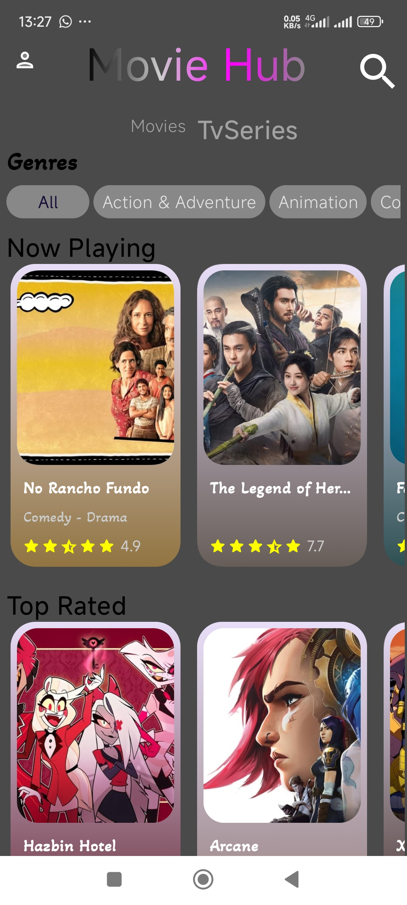
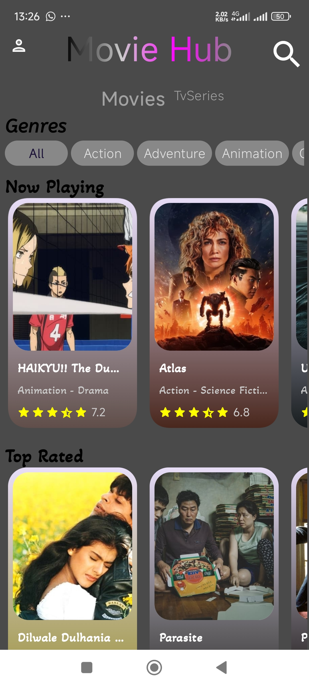
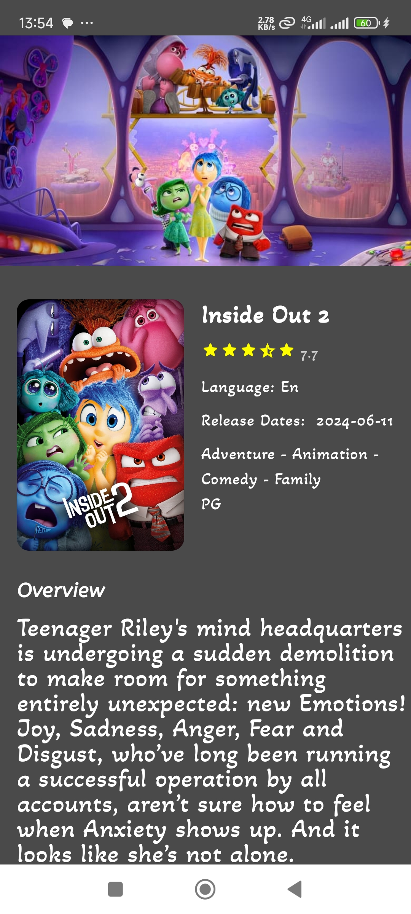
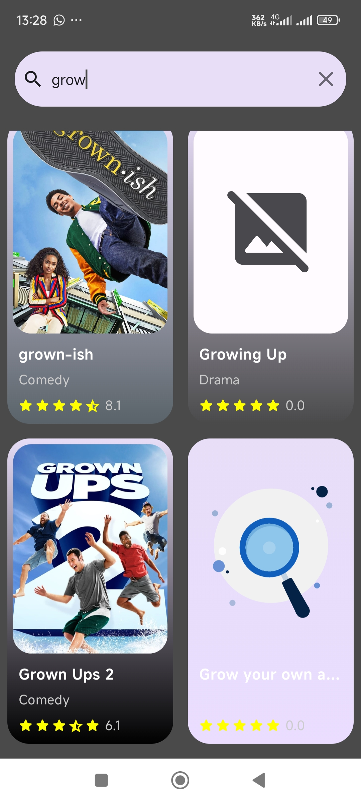
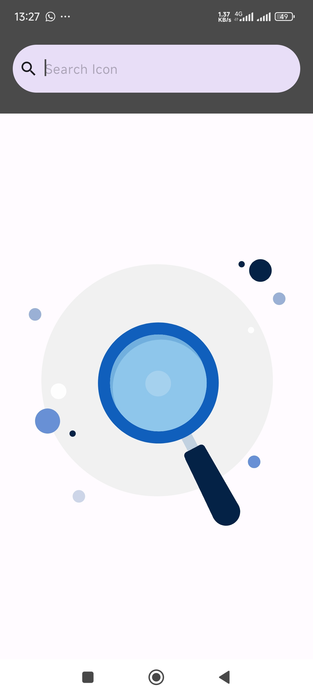

# MovieHub

An android app built using [Jetpack Compose](https://developer.android.com/jetpack/compose) that consumes [TMDB API](https://developers.themoviedb.org/3/getting-started/introduction) to display the current trending, upcoming, top rated, and popular movies and tv-shows.  
## Language
**Language:** Kotlin 100%

# Setup Requirements
First, obtain your API key from [TMDB](https://developers.themoviedb.org/3/getting-started/introduction) and add it in a file named `apikey.properties` within the root directory:

```bash
YOUR_API_KEY="****"
```
Then, replace it in the `build.gradle(:app)` :

```bash
...
buildConfigField("String", "YOUR_API_KEY", apikeyProperties['YOUR_API_KEY'])
```

Finally, rebuild the project for changes to take effect and don't forget to update the references of this key in the `MovieApi.kt` file.

```bash
...
@Query("api_key") apiKey: String = BuildConfig.YOUR_API_KEY,
```

---
# Tech Stack

- [MVVM Architecture](https://developer.android.com/topic/architecture) - A software architecture that removes the tight coupling between components. Most importantly, in this architecture, the children don't have the direct reference to the parent, they only have the reference by observables.
- [Hilt](https://dagger.dev/hilt/) - Hilt provides a standard way to incorporate Dagger dependency injection into an Android application.
- [Jetpack Components](https://developer.android.com/jetpack)
    - [Jetpack Compose](https://developer.android.com/jetpack/compose)- Modern toolkit for building native UI.
    - [Android KTX](https://developer.android.com/kotlin/ktx.html) - Provide concise, idiomatic Kotlin to Jetpack and Android platform APIs.
    -   [Lifecycle](https://developer.android.com/topic/libraries/architecture/lifecycle) - Perform actions in response to a change in the lifecycle status of another component, such as activities and fragments.
    - [Room](https://developer.android.com/training/data-storage/room) - Provides an abstraction layer over SQLite used for offline data caching.
    - [ViewModel](https://developer.android.com/topic/libraries/architecture/viewmodel) - Designed to store and manage UI-related data in a lifecycle conscious way. The ViewModel class allows data to survive configuration changes such as screen rotations.
- [Retrofit](https://square.github.io/retrofit/) - Type-safe http client and supports coroutines out of the box.
- [Lottie Files for Compose](https://github.com/airbnb/lottie) - Lottie is a library for Android, iOS, and Web that parses [Adobe After Effects](http://www.adobe.com/products/aftereffects.html) animations exported as json with [Bodymovin](https://github.com/airbnb/lottie-web) and renders them natively on mobile and on the web!
- [GSON](https://github.com/square/gson) - JSON Parser,used to parse
  requests on the data layer for Entities and understands Kotlin non-nullable
  and default parameters.
- [OkHttp Logging Interceptor](https://github.com/square/okhttp/blob/master/okhttp-logging-interceptor/README.md) - Logs HTTP request and response data.
- [Coroutines](https://github.com/Kotlin/kotlinx.coroutines) - Library Support for coroutines.
- [Flows](https://developer.android.com/kotlin/flow) - Flows are built on top of coroutines and can provide multiple values. A flow is conceptually a stream of data that can be computed asynchronously.

---

# Screenshots
 
   
 


## This app is currently in development and more features are being added: watching trailer etc......
> PRs are welcome :)

